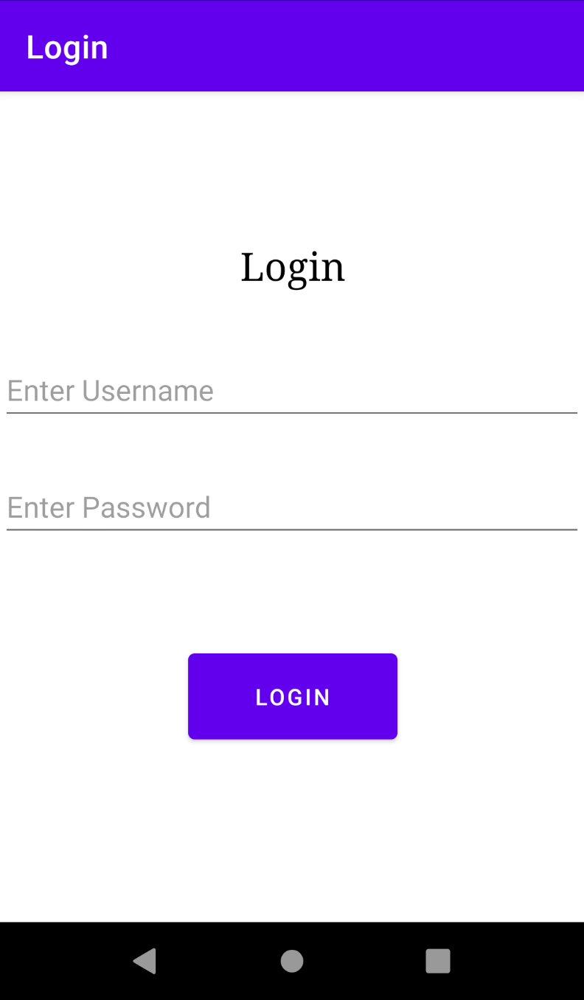
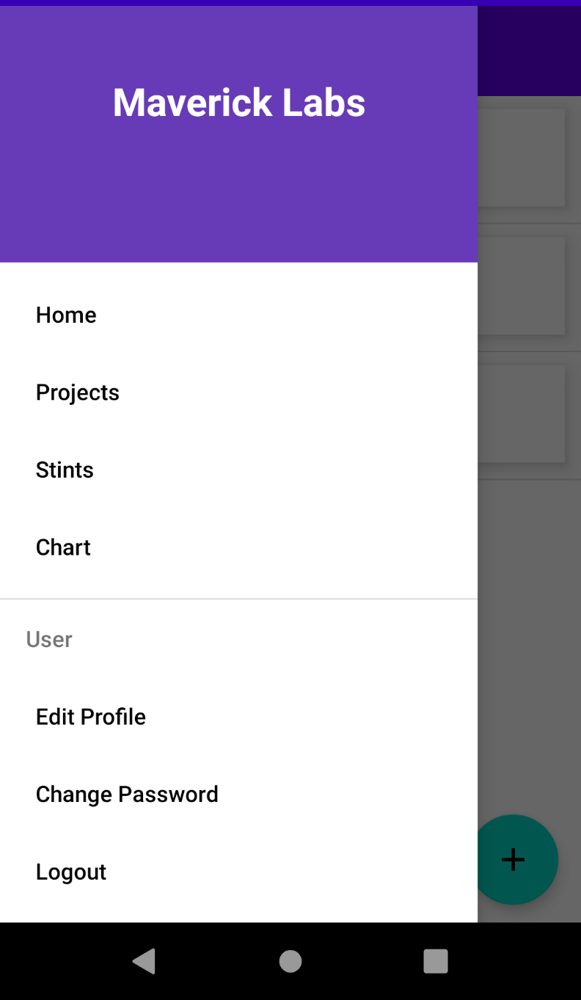
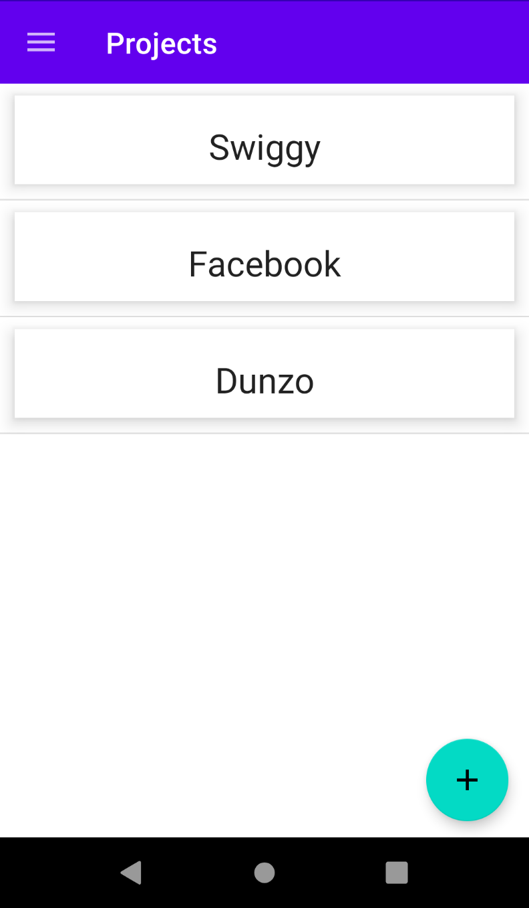
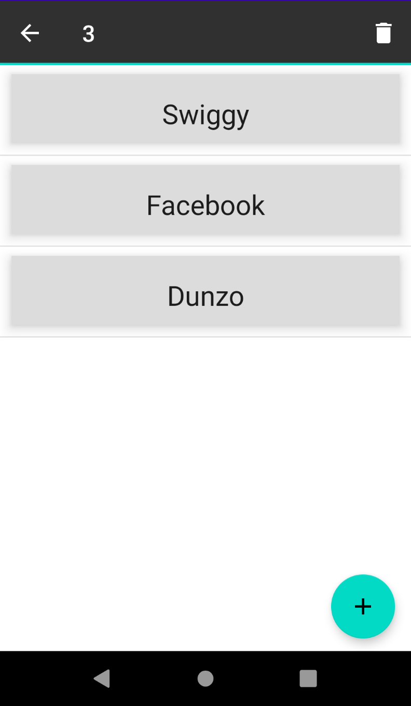
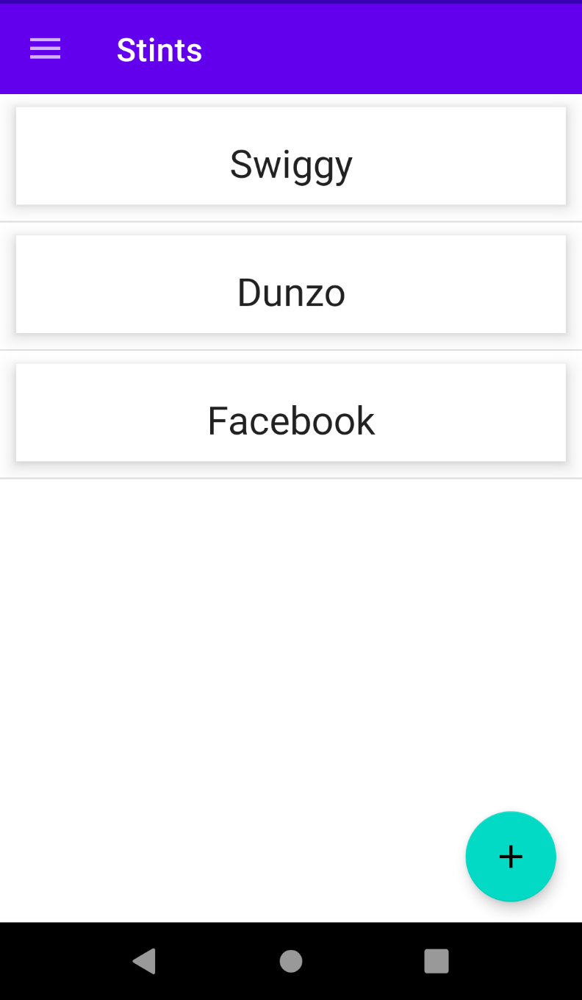
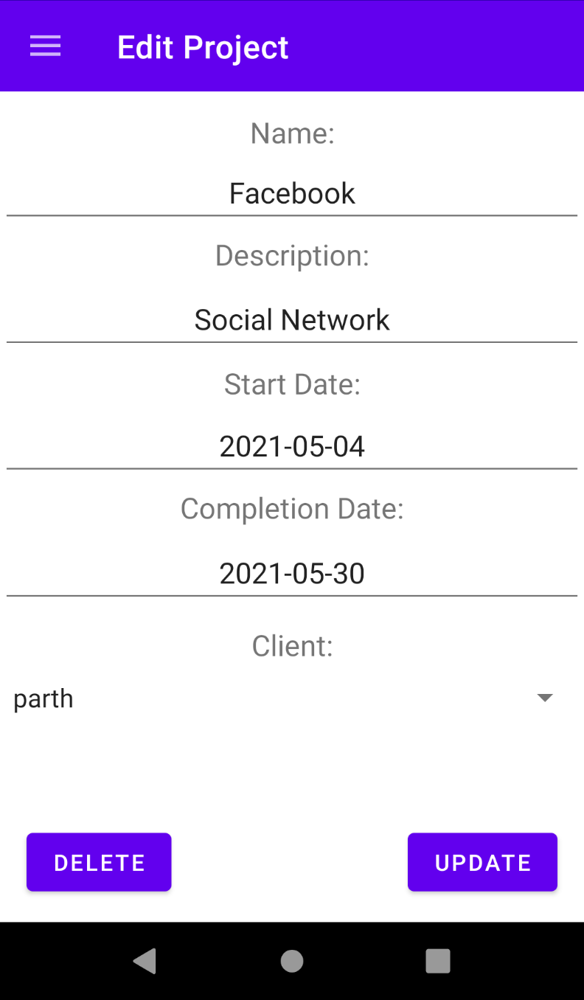
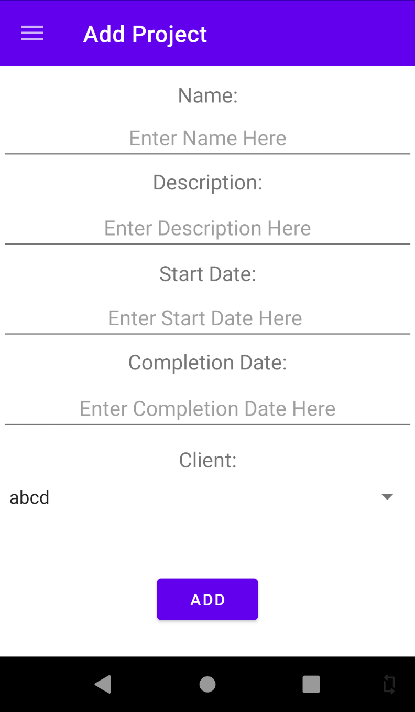
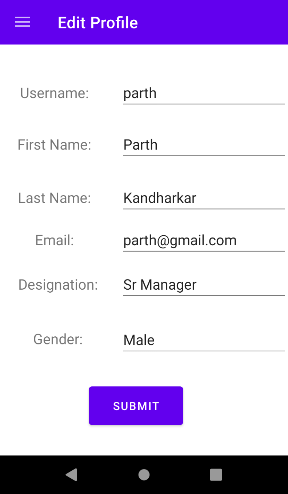

**MAVERICK LABS CATALOG APP**

This project is used to showcase and keep track of all the projects developed by Maverick Labs and other details such as who worked on which project and which technologies were used in which projects and who worked on which technology.Retrofit library is used to make api calls.

**Required**

Android Studio

Parth_drf api server

**Screenshots**











**Features**
- Add/Delete/Update/Retrieve Project
- Add/Delete/Update/Retrieve Stint
- Edit Profile
- Change Password
- Chart
- Logout

**Usage**

1. Gradle dependancy
    - Retrofit:
     
        `implementation 'com.squareup.retrofit2:retrofit:2.9.0'`
    - GSON:
    
        `implementation  'com.squareup.retrofit2:converter-gson:2.9.0'`
    - RecyclerView: 
    
        `implementation "androidx.recyclerview:recyclerview:1.2.0"`

        `implementation "androidx.recyclerview:recyclerview-selection:1.1.0"`
    - CardView:

        `implementation "androidx.cardview:cardview:1.0.0"`

    - AnyChart:

        `implementation 'com.github.AnyChart:AnyChart-Android:1.1.2'`
        
        ```
        allprojects {
            repositories {
                 maven { url 'https://jitpack.io' } 
            }
        }
        ```


        minSdkVersion 19

2. Retrofit configuration:

Change URL according to IP address of your device

    val URL = "http://192.168.1.3:8000/"
    private val logger = HttpLoggingInterceptor().setLevel(HttpLoggingInterceptor.Level.BODY)
    private val okHttp = OkHttpClient.Builder()
        .addInterceptor(logger)
    private  val builder =Retrofit.Builder().baseUrl(URL)
            .addConverterFactory(GsonConverterFactory.create())
            .client(okHttp.build())
    private val retrofit = builder.build()
    fun <T> buildService(serviceType:Class<T>): T {
        return retrofit.create(serviceType)
    }

**Compatibility**

Android Kitkat 4.4+
